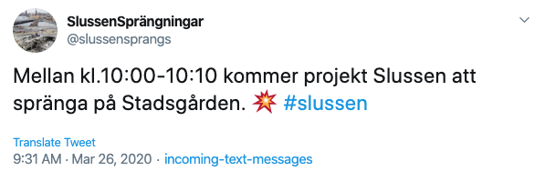

# [SlussenSprängningar](https://twitter.com/slussensprangs) Twitter bot

This is a simple Twitter bot that tweets whenever there are explosions happening due
to construction in the Slussen area of Stockholm.



It works by subscribing to [text messages from Stockholm Stad](https://www.anpdm.com/form/41475B4274464650467440/434A5F44714945504271)
whenever there are planned explosions, parsing those messages and posting them to Twitter.

> **Note**: This was hacked together in a short amount of time. It's not properly tested,
there's no good way to run it locally and it will probably blow up if you look at it
in the wrong way. Use it as inspiration for a text message to tweet service, but don't go
looking for best practices here.

## How it works

A text message is sent to a phone number managed by a third party and is forwarded to a webhook. This webhook is an API Gateway proxy endpoint that forwards the request to a lambda. The lambda checks in DynamoDB if it has seen this text message before (in case of re-sends), and if not, tries to parse the message. If it succeeds in parsing it, it generates a Tweet and sends it to Twitter. If successful, it records the message as processed in DynamoDB.

The Twitter account/app and the text-message forwarding is set up manually, and everything else is set up with AWS CDK.

## Set up

1. Create a Twitter account to tweet from, sign it up as a developer account and create
a Twitter app. There are loads of instructions online on how to do this.
2. Take the credentials from the Twitter app and put them into AWS SSM as:
    * `consumer_key`
    * `consumer_secret`
    * `access_token_key`
    * `access_token_secret`
3. In this project, run `yarn install`.
4. Copy the `.env.example` to `.env` and fill in the information.
5. `yarn build`
6. `yarn deploy`

The above steps assume that you have configured your AWS CLI so that you have credentials
set up. When you run the final step for the first time, you may get an error saying that you need to run `cdk bootstrap <something>`. Simply run the provided command, prefixed with `yarn`, i.e. `yarn cdk bootstrap ...`

In the output of the deploy step, you will get the URL to your API Gateway endpoint:

```shell
Outputs:
SlussensprangsStack.textmessageapiEndpointABC123 = https://bhjbjhb45.execute-api.eu-west-1.amazonaws.com/prod/
```

Now you need to provision a phone number via some provider and set it up to forward any text messages to that URL. I'm using [Vonage (formerly known as Nexmo)](https://nexmo.com). Each provider will call your endpoint with a different format, so if your chosen provider is not Vonage, you may have to update [`TextMessage.from`](./lib/text-message.ts) to accept the new format.

Once you have your phone number provisioned, [subscribe to updates from Stockholms Stad](https://vaxer.stockholm/projekt/slussen/pagaende-arbeten/) and everything should just work. You can send a text message yourself to your provisioned phone number to try it out.

## Commands

 * `npm run build`   compile Typescript to Javascript
 * `npm run watch`   watch for changes and compile
 * `npm run test`    run unit tests
 * `yarn cdk deploy` deploy this stack to your default AWS account/region
 * `yarn cdk diff`   compare deployed stack with current state
 * `yarn cdk synth`  emits the synthesized CloudFormation template

## Missing things

I don't know if I will do any of the things, but they are some of the more obvious things that could be done:

* Authentication on the webhook. Vonage doesn't support sending custom headers, so they send along the api_key int he query string. You'd have to write a custom lambda authorizer to be able to use that to authenticate the incoming request.
* Schedule a follow-up tweet right before the planned time. Currently they send out text messages quite a bit before the actual blasts, so it would be nice with a "It's gonna shake in a few minutes" type Tweet.
* Parse the location from the text message and use that in the Tweet
* More custom messaging instead of just forwarding the text message almost verbatim.